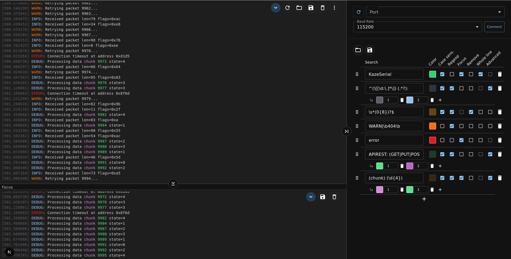

# Kaze Serial

**A modern serial terminal with advanced, yet easy, on the fly, highlighting features !**

Kaze Serial is a modern, high-performance serial terminal application built with **Tauri**, **Next.js**, and **React**. It provides a sleek interface for monitoring serial ports, with advanced log exploration features



## Features

- **Serial Connectivity**:
  - Automatic detection of available serial ports.
  - Configurable baud rates (9600 to 921600).
- **High-Performance Logging**:
  - Virtualized log list (using `react-window`) to handle large amounts of data efficiently.
  - Auto-scroll with pause-on-hover/scroll-up capability.
  - Clicking on a row of focus view will scroll the main log view to this element
- **Advanced Analysis**:
  - **Highlighting**: Define custom search patterns to highlight specific log messages with custom colors. Patterns can be:
    - Simple search
    - Case sensitive search
    - Regexp search
    - Entire line selection
  - **Split View**: A secondary "Focus" terminal to isolate matched logs or view different parts of the stream.
  - **Sentence removal**: Remove garbage by sentence matching 
- **Export/import**:
  - **export**: 
    - Export raw log (without highligh and sentence removal applied) to a file
    - Export the patterns for future use
  - **import**: 
    - Re-import previous log file
    - Re-import previous patterns 
- **Cross-Platform**: Runs on Linux and windows, not tested so far on macOS (powered by Tauri).

## Tech Stack

- **Frontend**: [Next.js](https://nextjs.org/) (React), TypeScript, [Material UI](https://mui.com/).
- **Backend**: [Tauri](https://tauri.app/) (Rust) for system interaction and serial port management.
- **State Management**: React Hooks + Tauri Commands.

## Getting Started

### Prerequisites

- **Node.js** (v18+ recommended)
- **Rust** (latest stable) & Cargo
- System dependencies for Tauri (see [Tauri Prerequisites](https://tauri.app/v1/guides/getting-started/prerequisites))

### Installation

1. Clone the repository:
   ```bash
   git clone https://github.com/simon0356/KazeSerial.git
   cd KazeSerial
   ```

2. Install frontend dependencies:
   ```bash
   npm install
   ```

### Development

To run the application in development mode (with hot-reloading for both frontend and Rust backend):

```bash
npm run tauri dev
```

### Build

To build the application for production:

```bash
npm run tauri build
```

The output binary/installer will be located in `src-tauri/target/release/bundle/`.

## Configuration

- **Highlights**: Highlight settings are automatically saved to `highlight_settings.json` in the application configuration directory.

## Background
Since I work as an embedded software developper, most of my work time consist of looking on serial monitor for debug purpose.
I used to work a lot with minicom and more recently with [Serial Monitor Rust](https://github.com/hacknus/serial-monitor-rust).
Highlight features on Serial Monitor Rust was not his main purpose and i'm not so confident with EGUI framework.  
Since I wanted to learn React, i did this simple project, and of course Copilot and LLM agent help me a lot for bootstraping this project

## License

[MIT](LICENSE)
